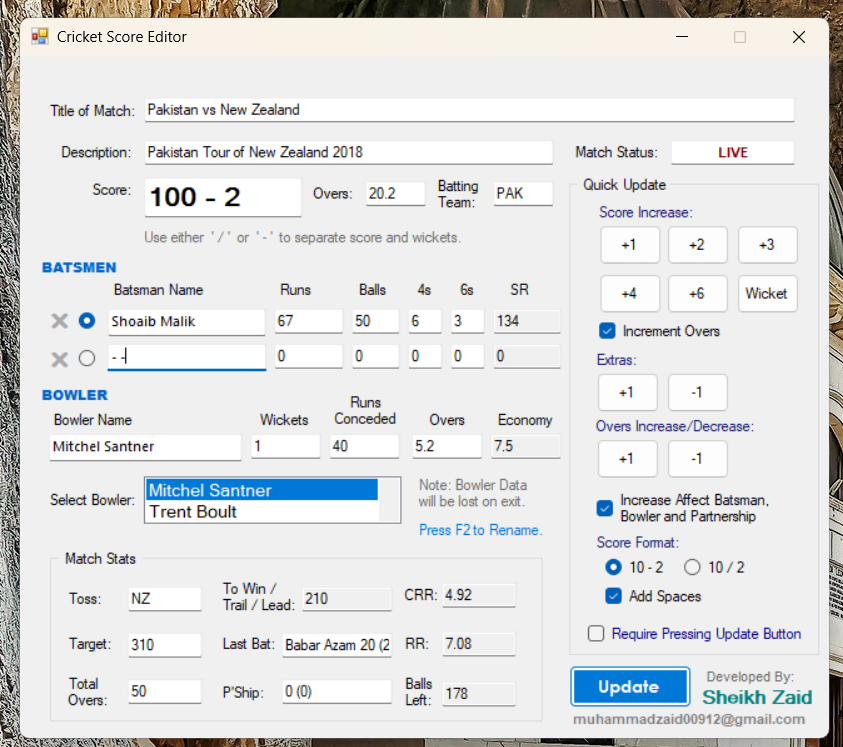

# Cricket Score Editor

A Windows desktop app for scoring a live cricket match and putting the numbers
straight onto a broadcast. You score with buttons (+1, +2, +4, +6, wicket,
extra), and the app writes every value out to its own plain text file.

Those files are the integration point. OBS, vMix and XSplit can all point a text
source at a file and re-read it when it changes, so the overlay on the stream
updates by itself. No plugin, no network, no API.



## Where this came from

One of the first real things I built, in 2020, near the start of my time writing
software. Not coursework, not for anyone else. I wanted to see whether I could
get a live score onto a stream, so I sat down and found out.

It was written before AI assistants existed and before I had been taught
anything formal about object orientation. What I find interesting looking back is
what I reached for anyway: a type to model a bowler, and parsers written by hand
for the score and the overs. Kept as a portfolio archive, exactly as it was.

## Features

- One click is one delivery. Pressing +1 credits the batsman, the bowler, the
  over, the strike rotation and the partnership, then writes it all to disk.
- Run rates, strike rates, economy, runs to win and balls left are always
  derived, never typed.
- Every field is still an editable text box, so you can correct anything or join
  a match already in progress.
- Closing and reopening restores the match from the same files it writes.
- A 31-slot bowler roster with per-bowler figures.

## How it works

**Text files as the interface.** `WriteFiles()` opens a `StreamWriter` per field
and writes one line each. Wiring up an overlay is drag-and-drop and no code. The
graphics can be rebuilt or moved to different software and this app never learns
about it. File names are in `WriteFiles()` in `Cricket Bot/Form1.cs`.

**Writes 32 files, reads back 25.** The seven it never reads are exactly the
derived ones (both run rates, runs to win, balls left, both strike rates,
economy). Startup restores the inputs and recomputes the rest, so saved state
cannot go internally inconsistent.

**The score string is a small protocol.** Tolerant in, strict out.
`HyphenRemover` normalizes the separator and accepts `150-3`, `150 / 3`,
`150 - 3` or a bare `150`, because the scorer types into the box directly.
`JoinScoreWickets` is the only thing that ever composes a score, always using the
configured separator. Changing the display style just re-runs it with zero runs
and zero wickets. Wickets clamp at ten.

**Overs are base six.** `12.3` is not a decimal, so `OversInBalls` converts to
`overs * 6 + balls` before any arithmetic. Run rates divide by balls over six,
not by the printed figure. `OversIncrement` does the carry by hand, and
`OversEdit` normalizes an out-of-range ball count as you type. That last one is
safe inside a text-changed handler because it is idempotent, so the event settles
after one extra pass.

**Derived values propagate through events**, not through a recompute pass. The
text boxes are the state and the handlers are the dependency graph:

| When this changes | These are recomputed |
| --- | --- |
| Score | Runs to win, current run rate, required run rate |
| Overs | Normalized, CRR, balls left, RRR, clamp against total overs |
| Total overs | RRR, balls left, clamp against overs |
| Target | Runs to win, required run rate |
| Batsman runs or balls | Both strike rates |
| Bowler runs or overs | Economy, write-through into the roster |

Buttons have no private update routine. They set text box values and the same
handlers fire, so the quick path and the manual path cannot drift apart.

**Nothing throws on a half-typed number.** There is not one `int.Parse` in the
codebase, only `TryParse` falling back to zero. A scorer mid-over leaves boxes
half-edited and every keystroke fires the recalculation chain, so a brief wrong
number beats an exception dialog over a live broadcast. Strike rate guards its
divide-by-zero separately.

**Each button is one delivery:**

| Button | Batsman | Bowler | Ball counted | Strike rotates |
| --- | --- | --- | --- | --- |
| +1, +3 | Runs, ball faced | Runs, over advanced | Yes | Yes |
| +2 | Runs, ball faced | Runs, over advanced | Yes | No |
| +4, +6 | Runs, ball, boundary tally | Runs, over advanced | Yes | No |
| Wicket | Ball faced | Wicket credited | Yes | No |
| Extra +1 | Untouched | Runs only | No | No |

Extras are the interesting row. A wide adds runs but is not a legal delivery, so
the batsman does not face it and the over does not advance. That is carried by
the `incOvers` flag and a zero balls argument, not a separate code path.

Strike rotation composes instead of special-casing. Odd runs call
`ChangeBatsman`; the end of an over calls it too. A single off the last ball
fires both, the batsmen cross and the ends swap, and the same batsman is on
strike. Correct behaviour for the awkward case, from two simple rules.

**The bowler roster.** 31 bowlers built at load into a jagged `string[31][]`. The
list box is not a copy, it is the index: `SelectedIndexChanged` loads a row into
the four boxes, and each box writes back into the same row. No save step, nothing
to sync. A blank rename turns the name box pale yellow rather than raising a
dialog, which is the right weight of feedback mid-match. F2 jumps to the name box.

## Running it

Needs Windows and .NET Framework 4.8. Open `Cricket Score Streamer.sln` in Visual
Studio 2019 or later and press F5, or:

```
msbuild "Cricket Score Streamer.sln" /p:Configuration=Release
```

Files are written to the working directory, so put the executable in a folder of
its own. A full session drops 32 text files beside it. To wire up a stream, add a
read-from-file text source and point it at `Score.txt`, `Overs.txt`,
`Batsman1_Name.txt` and so on.

## Configuration

All in-app, no config file.

| Setting | Effect |
| --- | --- |
| Require Pressing Update Button | Scoring buttons update the app but not the files. Nothing reaches the stream until Update is pressed. |
| Increment Overs | Scoring buttons advance the over count too. |
| Increase Affect Batsman, Bowler and Partnership | The manual overs +1 also charges the ball to the batsman, bowler and partnership. |
| Score format, 10-2 or 10/2 | Which separator the score is composed with. |
| Add Spaces | Whether that separator is padded. |

Match status, toss and batting team are uppercased before they are written.

## Project layout

| Path | What is there |
| --- | --- |
| `Cricket Bot/Form1.cs` | The whole application. Scoring, over arithmetic, parsing, calculations, file IO, bowler roster. |
| `Cricket Bot/Form1.Designer.cs`, `Form1.resx` | Generated WinForms layout and resources. |
| `Cricket Bot/Program.cs`, `Properties/` | Entry point and assembly metadata. |
| `Cricket Score Streamer.sln`, `*.csproj`, `App.config` | Solution, project and runtime config. |

## Author

Built by Muhammad Zaid in 2020.
